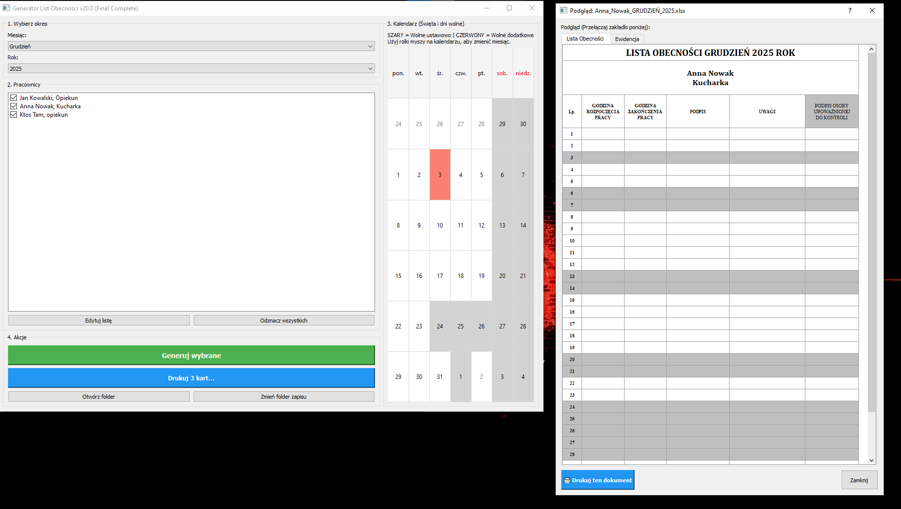

# GLO

## Opis

GLO to aplikacja desktopowa napisana w Pythonie, służąca do zarządzania i generowania raportów dla pracowników. System umożliwia tworzenie zestawień w formacie Excel dla poszczególnych pracowników w układzie miesięcznym.

Aplikacja oferuje:
- Interfejs graficzny (GUI) do zarządzania danymi pracowników
- Generowanie raportów w formacie .xlsx
- Automatyczne tworzenie plików z nazwą według wzorca: `{Imię}_{Nazwisko}_{MIESIĄC}_{ROK}.xlsx`
- Przechowywanie listy pracowników w pliku tekstowym
- Obsługę wielu pracowników jednocześnie

Projekt jest zbudowany w architekturze monolitycznej z prostym interfejsem użytkownika, który umożliwia szybkie generowanie raportów bez potrzeby znajomości programowania.

## Zrzuty ekranu



## Struktura projektu

```
GLO/
├── .gitignore
├── .idea/
│   ├── GLO.iml
│   ├── misc.xml
│   └── workspace.xml
├── screenshot/
│   └── main.png
├── main.py
├── pracownicy.txt
├── README.md
├── brief.md
├── plan.md
├── etapy.md
├── debug.log
├── Anna_Nowak_GRUDZIEŃ_2025.xlsx
├── Jan_Kowalski_GRUDZIEŃ_2025.xlsx
└── Ktos_Tam_GRUDZIEŃ_2025.xlsx
```

## Instalacja

### Wymagania wstępne
- Python 3.7 lub nowszy

### Kroki instalacji

1. Sklonuj repozytorium:
```bash
git clone https://gitlab.com/MarcinCichy/glo.git
cd glo
```

2. Zainstaluj wymagane biblioteki:
```bash
pip install openpyxl
```

## Konfiguracja

Aplikacja wykorzystuje plik `pracownicy.txt` do przechowywania listy pracowników. Format pliku powinien zawierać imiona i nazwiska pracowników (po jednym w linii lub w odpowiednim formacie obsługiwanym przez aplikację).

## Uruchomienie

Aby uruchomić aplikację, wykonaj następujące polecenie w katalogu projektu:

```bash
python main.py
```

Aplikacja uruchomi interfejs graficzny, w którym można:
1. Wybrać pracownika z listy
2. Wybrać miesiąc i rok
3. Wygenerować raport Excel

## Zależności

Projekt wykorzystuje następujące biblioteki Python:

- `openpyxl` - do tworzenia i manipulacji plikami Excel (.xlsx)
- `tkinter` - do interfejsu graficznego (wbudowany w Python)

### Instalacja zależności:
```bash
pip install openpyxl
```

---

# GLO

## Description

GLO is a desktop application written in Python, designed for managing and generating employee reports. The system enables creating Excel spreadsheets for individual employees organized by month.

The application offers:
- Graphical User Interface (GUI) for managing employee data
- Report generation in .xlsx format
- Automatic file creation with naming pattern: `{FirstName}_{LastName}_{MONTH}_{YEAR}.xlsx`
- Employee list storage in a text file
- Support for multiple employees simultaneously

The project is built in a monolithic architecture with a simple user interface that allows quick report generation without requiring programming knowledge.

## Screenshots


## Project structure

```
GLO/
├── .gitignore
├── .idea/
│   ├── GLO.iml
│   ├── misc.xml
│   └── workspace.xml
├── screenshot/
│   └── main.png
├── main.py
├── pracownicy.txt
├── README.md
├── brief.md
├── plan.md
├── etapy.md
├── debug.log
├── Anna_Nowak_GRUDZIEŃ_2025.xlsx
├── Jan_Kowalski_GRUDZIEŃ_2025.xlsx
└── Ktos_Tam_GRUDZIEŃ_2025.xlsx
```

## Installation

### Prerequisites
- Python 3.7 or higher

### Installation steps

1. Clone the repository:
```bash
git clone https://gitlab.com/MarcinCichy/glo.git
cd glo
```

2. Install required libraries:
```bash
pip install openpyxl
```

## Configuration

The application uses the `pracownicy.txt` file to store the employee list. The file format should contain employee first and last names (one per line or in the appropriate format supported by the application).

## Usage

To run the application, execute the following command in the project directory:

```bash
python main.py
```

The application will launch a graphical interface where you can:
1. Select an employee from the list
2. Choose the month and year
3. Generate an Excel report

## Dependencies

The project uses the following Python libraries:

- `openpyxl` - for creating and manipulating Excel files (.xlsx)
- `tkinter` - for the graphical interface (built into Python)

### Installing dependencies:
```bash
pip install openpyxl
```